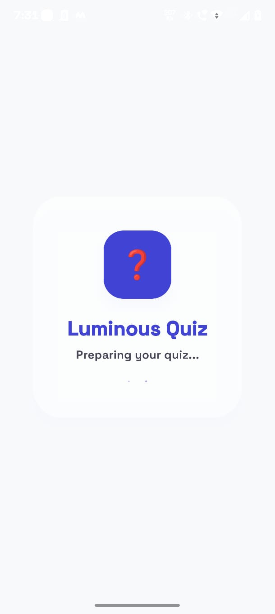
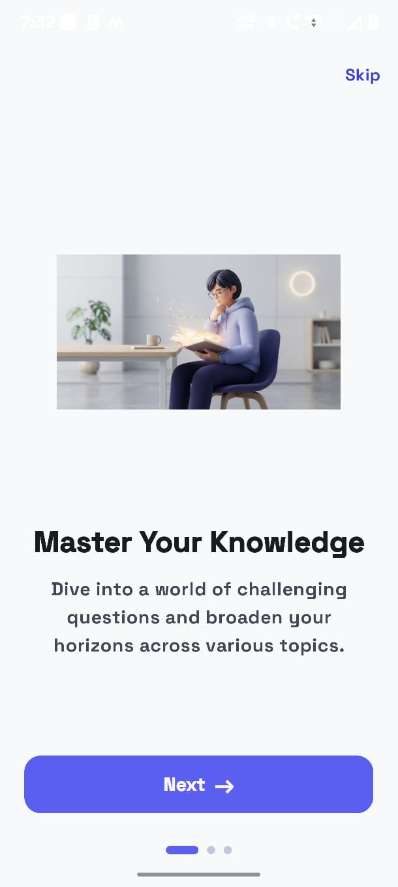
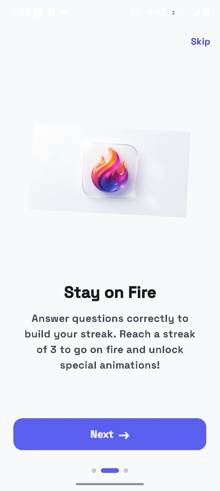
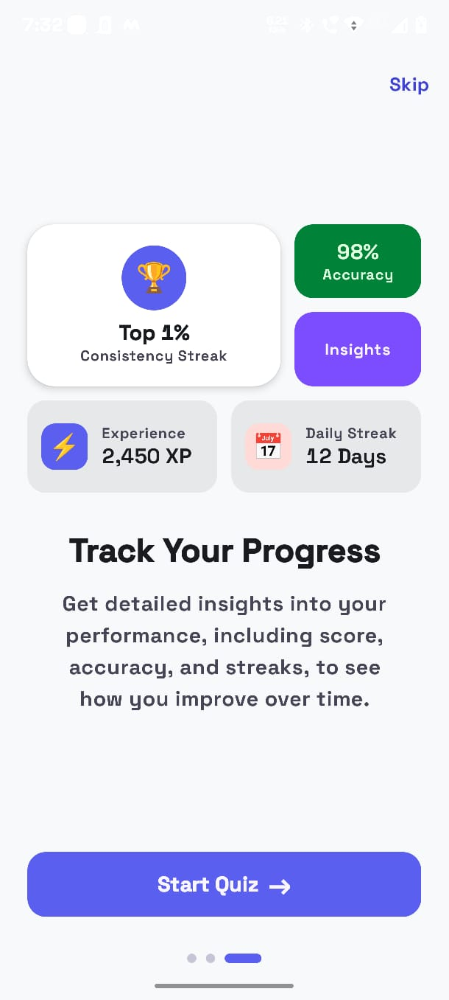
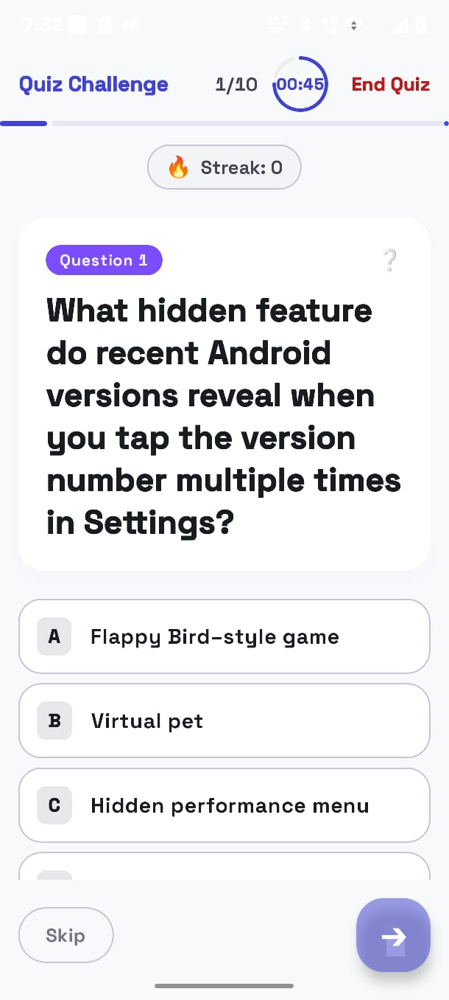

# Luminous Quiz App

A modern, beautifully animated Android Quiz Application built with Jetpack Compose. This app features a premium UI, smooth animations, and a seamless onboarding experience, all designed to keep users engaged and learning.

## Features

- **Modern Architecture**: Built using MVVM architecture with StateFlow and Jetpack Navigation.
- **Splash Screen**: A sleek entry point that sets the tone for the app.
- **Interactive Onboarding**: A 3-step beautifully animated pager to introduce the app.
  - Features custom floating animations and a detailed "Bento Grid" statistics preview.
- **Dynamic Quiz Flow**:
  - Auto-advance on answer selection.
  - Swipe left to skip.
  - Animated progress bar and a vibrant streak counter.
- **Interactive Timer**: A circular animated timer that pulses red when time is running out.
- **Results Screen**: Detailed post-quiz insights (score, accuracy, time taken).

## App Flow & Screenshots

To see the visual flow of the app, please place your screenshots in a `screenshots/` directory with the names below:

### 1. Splash Screen
The initial launch screen.

  

### 2. Onboarding: Master Your Knowledge
The first onboarding page featuring a floating illustration.

  

### 3. Onboarding: Stay on Fire
The second onboarding page introducing the streak mechanic.

  

### 4. Onboarding: Track Your Progress
The final onboarding page featuring a native Compose Bento Box UI.

  

### 5. Quiz Challenge
The core quiz experience with progress tracking, streak fire, timer, and swipe gestures.

  

## Tech Stack

*   **UI Toolkit**: Jetpack Compose (Material 3)
*   **Architecture**: MVVM (Model-View-ViewModel)
*   **State Management**: Kotlin Flow & StateFlow
*   **Navigation**: Jetpack Compose Navigation
*   **Animations**: Compose Animation APIs (`AnimatedContent`, `rememberInfiniteTransition`, `Animatable`)

## Getting Started

1. Clone the repository.
2. Open the project in **Android Studio**.
3. Build the project using Gradle.
4. Run the app on an emulator or physical device running Android API 24 or higher.

## License
MIT License
